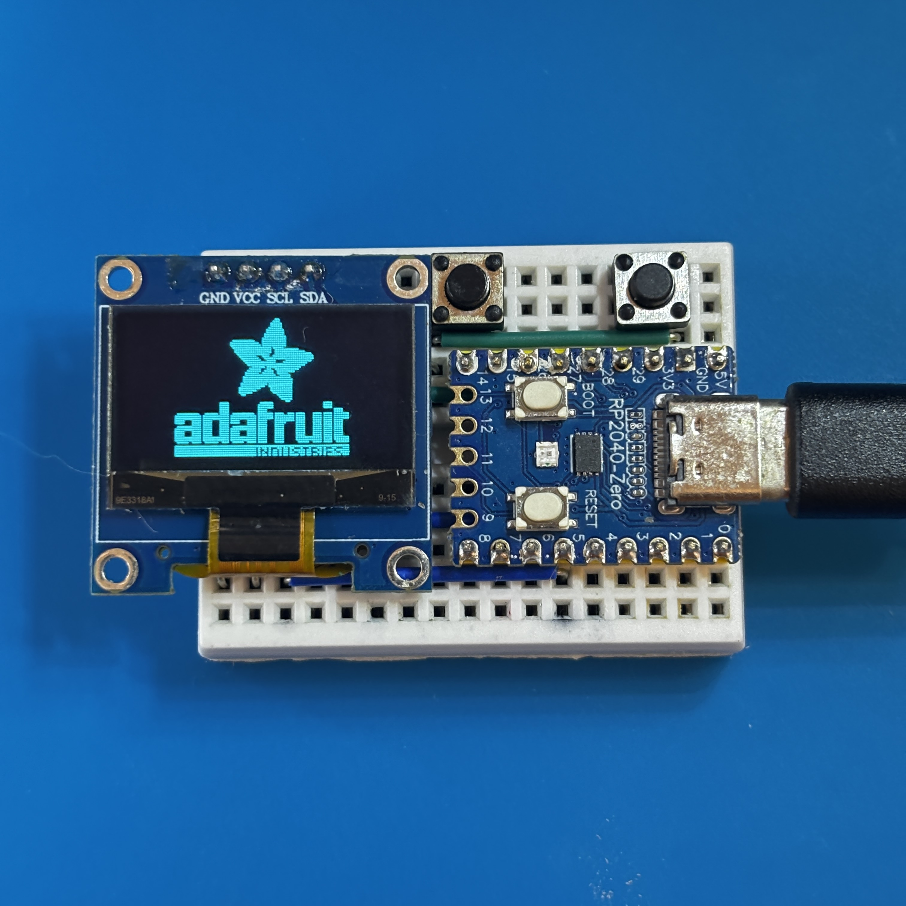
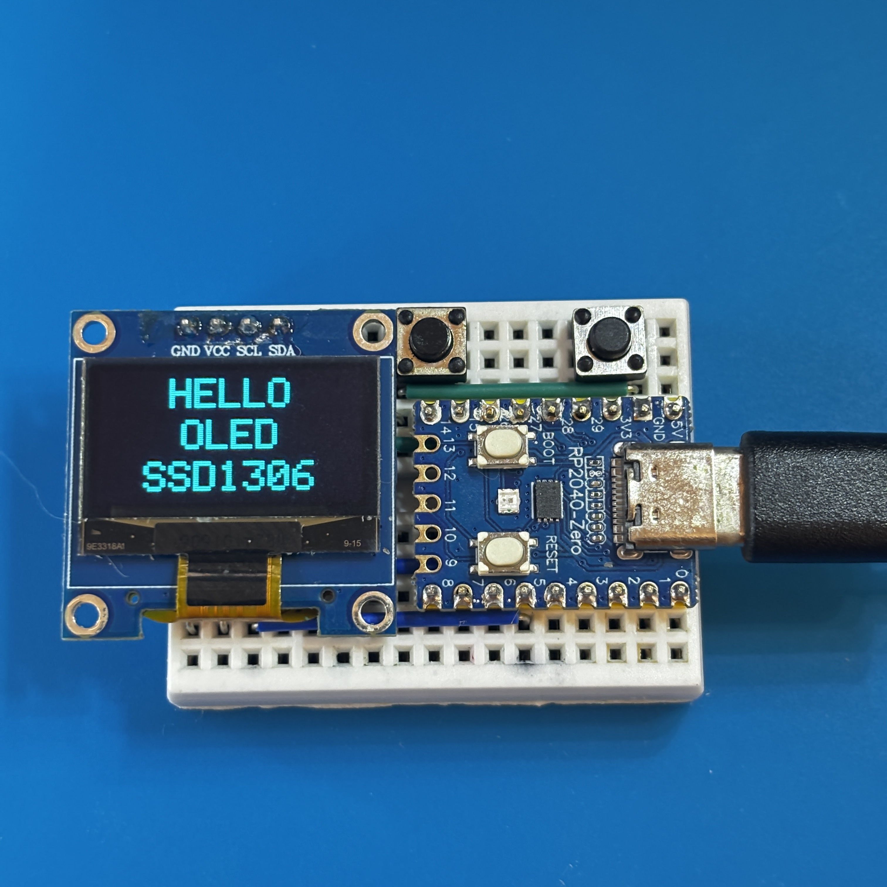
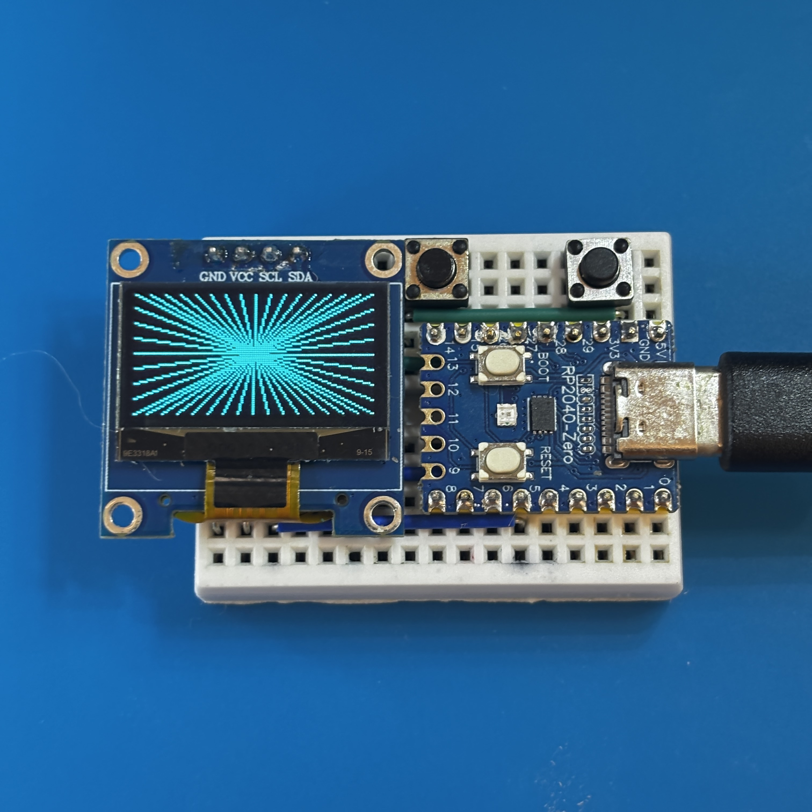
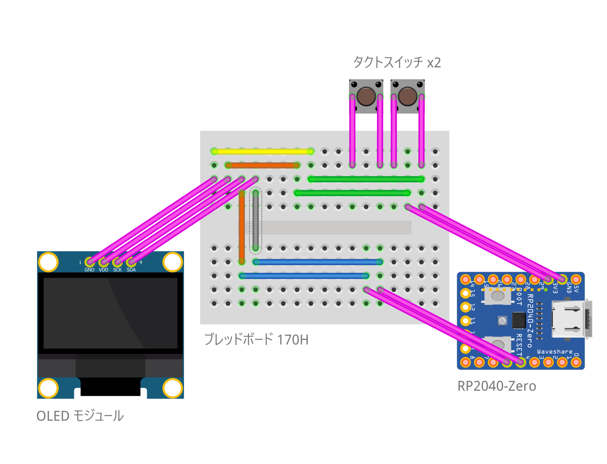

# Arduino: RP2040-OLED-Tester Application

RP2040-Zero を使用した OLED の動作確認ツールです。

左右ボタンの操作で表示パターンが切り替わります。

## 表示パターン

1. **LOGO**: ロゴ表示パターン
2. **TEXT**: "Hello!" 表示後、"OLED 128x64 SSD1306" のティッカー表示
3. **GRAPHICS**: 動的なラインパターン表示

## 部材

| 種別 | 型番など | 数量 |
|:-----|:---------|:-----|
| マイコン | RP2040-Zero | 1個 |
| OLED モジュール | 0.96" 128x64 SSD1306 | 1個 |
| タクトスイッチ | 2P 6x6mm | 2個 |
| ブレッドボード | 170H | 1個 |
| ジャンパーワイヤ | - | 8本 |

## 接続

### OLED ディスプレイ

| OLED モジュール | RP2040-Zero |
|:---|:---|
| VCC | 3.3V |
| GND | GND |
| SDA | GPIO 4 (SDA) |
| SCL | GPIO 5 (SCL) |

### タクトスイッチ

| タクトスイッチ | RP2040-Zero |
|:--------|:------------------|
| タクトスイッチ #1 PIN 1 | GPIO 26 |
| タクトスイッチ #1 PIN 2 | GPIO 28 |
| タクトスイッチ #2 PIN 1 | GPIO 29 |
| タクトスイッチ #2 PIN 2 | GND |

## 配線図

## 開発環境

### 必須ソフトウェア

| ソフトウェア | 説明 |
|:-----------|:-----|
| Arduino IDE | 開発環境 |

### 依存ライブラリ

| ライブラリ | 説明 |
|:-----------|:-----|
| Adafruit GFX Library | OLEDグラフィックス描画 |
| Adafruit SSD1306 | SSD1306 OLEDディスプレイ制御 |

**インストール**: Arduino IDEのライブラリマネージャーで検索・インストール

## 操作

マイコンに電源を供給すると作動します。

ディスプレイにテストパターンが表示されます。

左ボタンを押すと逆方向に、右ボタンを押すと順方向に表示パターンが切り替わります。

## ライセンス

このプロジェクトは [MIT ライセンス](./LICENSE) の下で公開されています。
自由に使用、改変、再配布していただけます。
